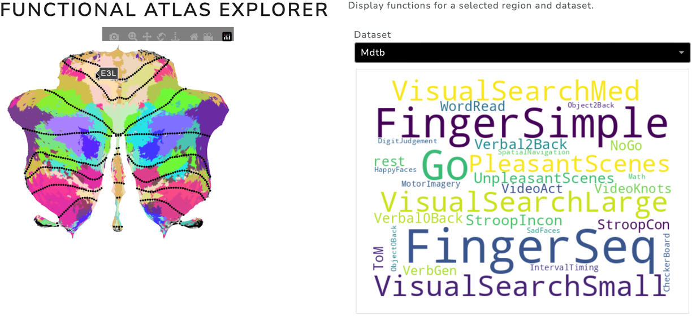
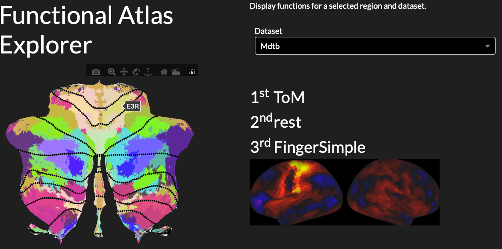

# Functional Atlas Explorer
The Functional Atlas Explorer was built during Western Brainhack 2022. It has two main features:
1. On clicking on a cerebellar region, it shows the functions that this region is involved in.
2. On clicking on a cerebellar region, it shows the functional connectivity of this region with the neocortex.

These features are currently running for the cerebellum (showing connectivity with the neocortex), although the atlas explorer could be extended to other brain regions.

:trophy: Thank you to Brainhack Western for awarding us the **Open Science Award** for this project!  :trophy:

## Exploring Functions
To run the word cloud app:
- Run ```python flatmap_app_click_WC.py```
- In your preferred browser, open the server link that is displayed (usually ```http://127.0.0.1:8050```).
- Click on a region in the cerebellum and the word cloud of functions will pop up.
- Change the dataset from which you would like to see the functions displayed in the drop-down menu.



## Exploring Connectivity
To run the connectivity app:
- Run ```python flatmap_app_clickable_connectivity.py```
- Open the server link that is displayed (usually ```http://127.0.0.1:8050```).
- Click on a region in the cerebellum and the cortical map will show cortical regions that are functionally connected to this cerebellar region.
- The app will also display the 3 most highly activated task conditions from the cerebellar region for a chosen dataset (change the dataset in the drop-down menu).




## Installation
These instructions were written for the Brainhack Project Participants with little to no coding experience, hence the detailed instructions. But they still work for getting the app to run.

1. Clone this repository.
   ```git clone https://github.com/carobellum/functional_atlas_explorer.git```

2. Navigate to the repository (```cd /path/to/your/repository/cone/functional_atlas_explorer```) and make a new environment.
   ```python -m venv env```

3. Activate your new environment.
   ```source env/bin/activate```

4. Install the packages that we need for this project.
   ```pip install pandas numpy scipy nibabel SUITPy matplotlib seaborn pickle5 ipykernel neuroimagingtools ipykernel torch nilearn dash jupyter-dash dash_boostrap_components```

5. You might have to update your nbformat package (this might only be the case for some of you), so to be sure run ```pip install --upgrade nbformat```

6. Clone the ```surfAnalysisPy``` repository and add it to your PYTHONPATH so that Python finds it. Run ```git clone https://github.com/DiedrichsenLab/surfAnalysisPy.git```.

Done! Now try running the cells in the jupyter notebook ```brainhack_example.ipynb``` and explore the plots. Try to understand what the code is doing and what you see in the plots. On Day 2, we are going to work on making integrative plots of the functional profiles of the voxels!

Let me know if you ran into any errors and we will fix them together :)

### Troubleshooting
If you run into errors, there is a few things to check before looking further:
- Are you running your python code in the correct environment?
  - Did you activate the environment for your terminal only, but your jupyter notebook is not using your environment? Depending on which code editor you use (I prefer VSCode), you will have to look in different places. For VSCode, have a look [here](https://code.visualstudio.com/docs/datascience/jupyter-notebooks).
- Did you install all of the packages in step 4? Did you install them into the correct environment?

## Getting started with dash

Have a look at the scripts starting with ```app```.

```tutorials/app.py```   [Tutorial](https://dash.plotly.com/layout)

```tutorials/app_hover.py``` [Tutorial](https://dash.plotly.com/interactive-graphing)

```tutorials/app_tooltip.py``` [Tutorial](https://dash.plotly.com/dash-core-components/tooltip?_gl=1*1ljxuab*_ga*Mjk4OTgyNTMuMTY2OTIyNjI0Ng..*_ga_6G7EE0JNSC*MTY2OTg0OTU4MC44LjEuMTY2OTg1MDg1MC4wLjAuMA)

More Dash Tutorials can be found [here](https://medium.com/sfu-cspmp/plotly-dash-story-edbb8c3e151e).

These are example scripts taken from the [Plotly Dash Guide](https://dash.plotly.com/). Try playing around with these and understanding the code, particularly of ```app_tooltip.py``` - this is pretty close to what we want to build!

## Links

Have a look at the [cerebellar atlas viewer](https://www.diedrichsenlab.org/imaging/AtlasViewer/index.htm) to see an example of an interactive visualisation tool.

We will be working with [plotly](https://pypi.org/project/plotly/) to get our interactive functional atlas explorer running.
Check out [this chapter](https://dash.plotly.com/interactive-graphing) of the plotly guide that covers interactive graphing.
